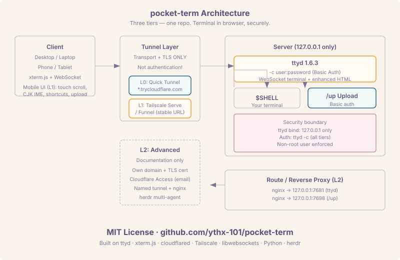

# pocket-term — Your terminal, in your browser

> Zero-config web terminal for any machine. One command, no accounts, no domains.

<p align="center">
  
</p>

---

## Quick start

### L0 — Quick tunnel (any machine, no setup)

```bash
curl -fsSL https://raw.githubusercontent.com/ythx-101/pocket-term/main/scripts/l0-quick.sh | bash
```

Opens a browser-based terminal behind a random Cloudflare tunnel URL.
**Ctrl-C to stop.** The URL changes every time — this is the trade-off for zero configuration.

### L1 — Daily driver (recommended)

```bash
git clone https://github.com/ythx-101/pocket-term.git
cd pocket-term
./scripts/install-l1.sh
```

A persistent web terminal with:
- 📱 Mobile-optimized page (touch scrolling, soft keyboard, CJK IME)
- 📎 File &amp; image upload (`/up`)
- 🔑 Auto-generated 24-character random password
- 🔒 Tailscale serve/funnel for a stable address
- ⚡ systemd/launchd auto-start

See [README L1 section](#l1-daily-driver-recommended) for full details.

### L2 — Advanced (your own domain + access control)

Documentation-only. See [docs/L2-advanced.md](docs/L2-advanced.md).

---

## Security

- **All tiers require basic auth.** ttyd binds `127.0.0.1` only. The tunnel (quick tunnel / serve / funnel) is transport-only — authentication is handled by ttyd `-c`.
- **Run as non-root.** Install scripts warn forcefully if run as root.
- **Upload endpoint is also authenticated.** `/up` shares the same credentials file.
- See [docs/security.md](docs/security.md) for the full threat model.

---

## Layered overview

| Tier | Tunnel | Auth | Upload | Persistence | Mobile UI |
|------|--------|------|--------|-------------|-----------|
| L0 | Quick tunnel | ttyd -c | — | None | Bare ttyd |
| L1 | Tailscale serve/funnel | ttyd -c | /up (Basic auth) | systemd/launchd | Enhanced |
| L2 | Cloudflare Access + named tunnel | ttyd -c + CF Access | /up + CF Access | nginx + systemd | Enhanced |

---

## Agent usage (SKILL.md)

This repository is also a Claude Code skill. Tell your agent:

> Use the pocket-term SKILL.md to set up a web terminal for this machine.

The skill auto-detects your environment, selects the right tier, and runs the
install scripts with appropriate flags. See [SKILL.md](SKILL.md).

---

## Acknowledgements

pocket-term builds on excellent open-source projects:

| Project | License | URL |
|---------|---------|-----|
| [ttyd](https://github.com/tsl0922/ttyd) | MIT | Terminal sharing over the web |
| [xterm.js](https://github.com/xtermjs/xterm.js) | MIT | Terminal front-end component |
| [libwebsockets](https://github.com/warmcat/libwebsockets) | MIT | C WebSocket library (ttyd dependency) |
| [cloudflared](https://github.com/cloudflare/cloudflared) | Apache-2.0 | Cloudflare Tunnel client |
| [Tailscale](https://github.com/tailscale/tailscale) | BSD-3-Clause | Mesh VPN with serve/funnel |
| [Python](https://www.python.org/) | PSF | Scripting and upload server |
| [herdr](https://github.com/earendil-works/herdr) | MIT | Terminal multiplexer (L2) |

---

## Documentation

- [docs/security.md](docs/security.md) — Threat model and security design
- [docs/L2-advanced.md](docs/L2-advanced.md) — Domain + Cloudflare Access + herdr
- [docs/windows.md](docs/windows.md) — WSL and native notes
- [AGENTS.md](AGENTS.md) — Machine-verifiable setup/verify/uninstall steps

## License

MIT — see [LICENSE](LICENSE).
